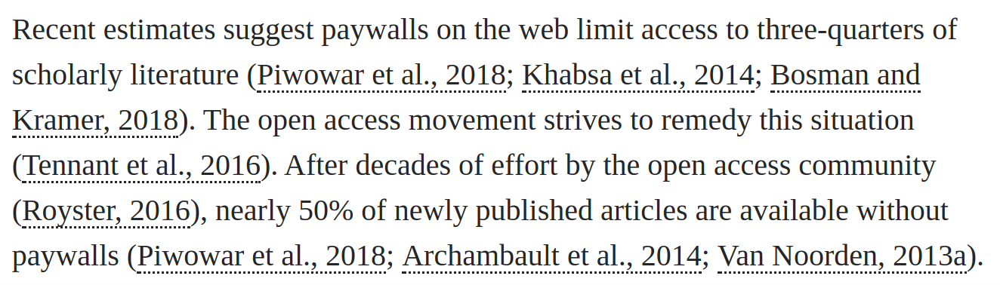
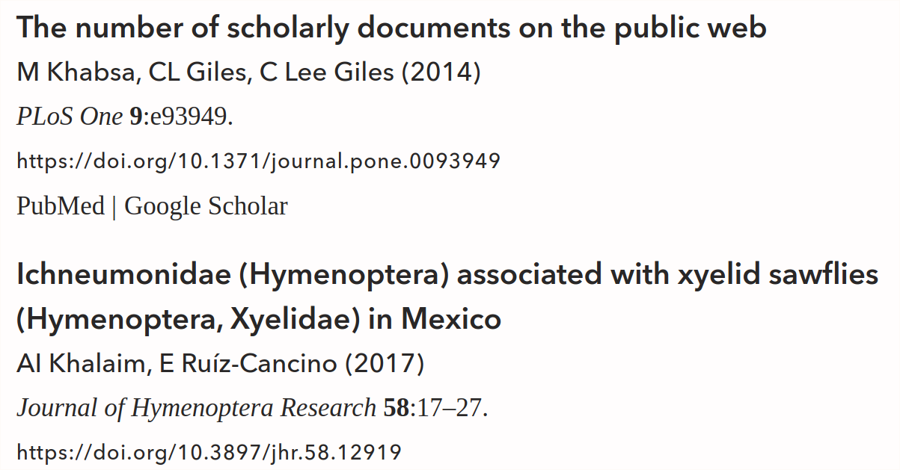
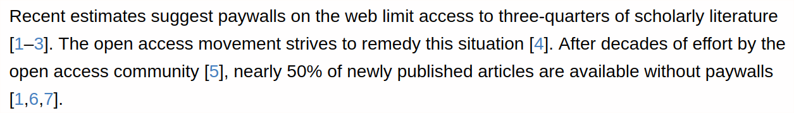
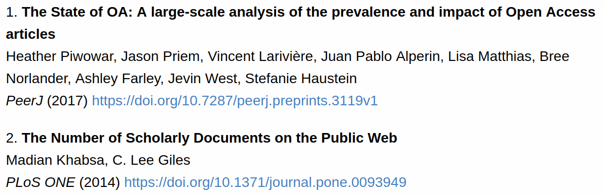

Title: On author versus numeric citation styles
Slug: cite-styles
Date: 2018-03-20
Tags: bibliography, references, citations, works cited, journals, Manubot, eLife, PeerJ, Thinklab
Status: draft

Should citations in scholarly writing appear as author-year snippets, like ([Pantcheva, 2018](http://site.uit.no/english/writing-style/citationstyles/ "Citation styles: Vancouver and Harvard systems"); [Zelle, 2015](http://docs.citationstyles.org/en/1.0.1/primer.html "Primer — An Introduction to CSL: v1.0.1")), or numbers, like [[1](),[2]()]?
Let's refer to these two methods as _author-style_ and _numeric-style_.
You may have also heard them referred to as the [Harvard](https://en.wikipedia.org/wiki/Parenthetical_referencing) and [Vancouver](https://en.wikipedia.org/wiki/Vancouver_system) referencing systems.

## Author-style

Here's an example of author-style from our recent Sci-Hub Coverage Study published in _eLife_.
First, notice how citations appear in the main text:



Notice how studies with 3 or more authors use "et al." rather than listing every single author.
Also note how the letter `a` was appended to `Van Noorden, 2013` to denote that this is the first of the two Van Noorden articles from 2013 that we cited.

With author-style, references (items in the bibliography) are sorted alphabetically by first-author's surname:

{widht="70%"}

## Numeric-style

Here's the same paragraph as above, but using numeric-style, which is the default for Manubot – the tool we used to write [the manuscript](https://greenelab.github.io/scihub-manuscript/):



When using numeric-style citations, references are numbered according to the order they were cited.
As such, the references section (bibliography) is a numbered list:



## Usage

In general, each journal (or even publisher) has a preferred citation style that's applied to all of their articles.
However, I couldn't find much information on the overall prevalence of the two styles.
Hence, I turned to the PubMed Central (PMC) Open Access Subset](https://www.ncbi.nlm.nih.gov/pmc/tools/openftlist/), which contained fulltexts for XX articles in a consistent XML format.

This corpus is fantastic for text & data mining, but note that XX% of all 4784205 articles in PMC are excluded from the OA Subset, since their publishers' apply legal barriers to restrict their availability and reuse.
The OA Subset has previously been used to (allegedly) [detect](https://doi.org/10.1038/d41586-018-02421-3) duplicated images, but can also be used 


PeerJ, eLife, Ubiquity Press journals

## Numberic-style

PLOS, BMC-series journals, Nature journals


There are two main ways to organize reference lists and citations in scholarly writing.


Numbered references or alphabetical

Textual citation, Parenthetical citation

Downside of texual (in-line citations)

## Popularity


## Get

ftp://ftp.ncbi.nlm.nih.gov/pub/pmc

```
<xref rid="ref-68" ref-type="bibr">WorldClim, 2013</xref>
```

https://www.ncbi.nlm.nih.gov/pmc/oai/oai.cgi?verb=GetRecord&identifier=oai:pubmedcentral.nih.gov:156895&metadataPrefix=pmc
https://www.ncbi.nlm.nih.gov/pmc/oai/oai.cgi?verb=GetRecord&identifier=oai:pubmedcentral.nih.gov:4304851&metadataPrefix=pmc


PMC4304851

